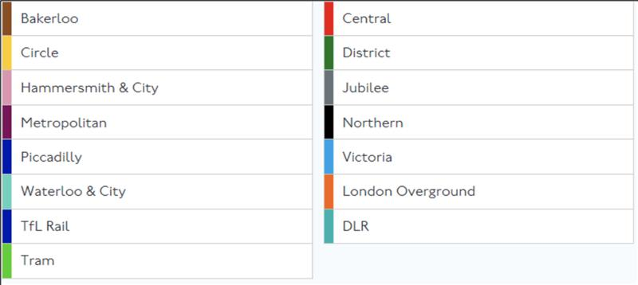

# TfL Unified API Project

This project is designed to test your ability to work with third-party APIs. It
will reinforce your ability to read and understand documentation that isn't your
own. Specifically, you will be using the TfL Unified API to request tube status
information and display them on-screen.

## Requirements

1. Each tube line should display its relevant colour, line name, and status.
2. The tube lines should show on two columns, and re-flow depending on the
   device.

Happy coding!
